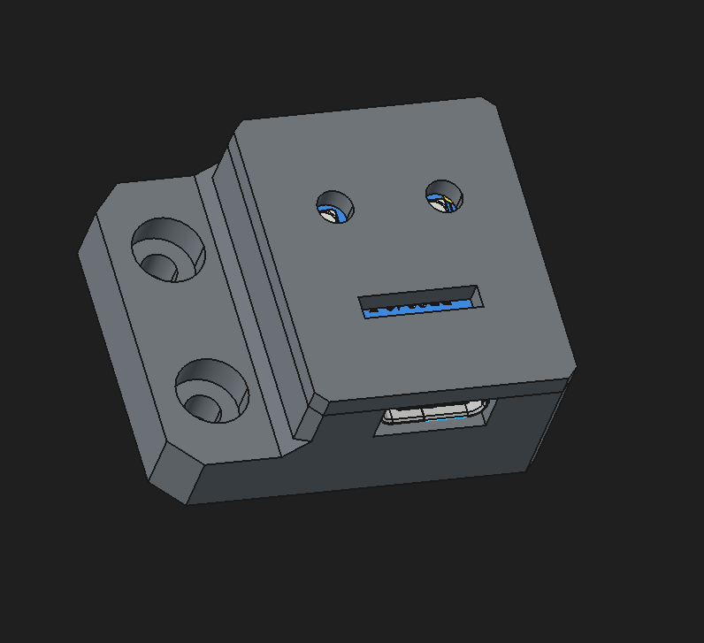
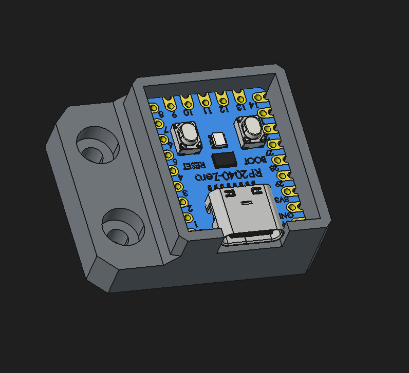
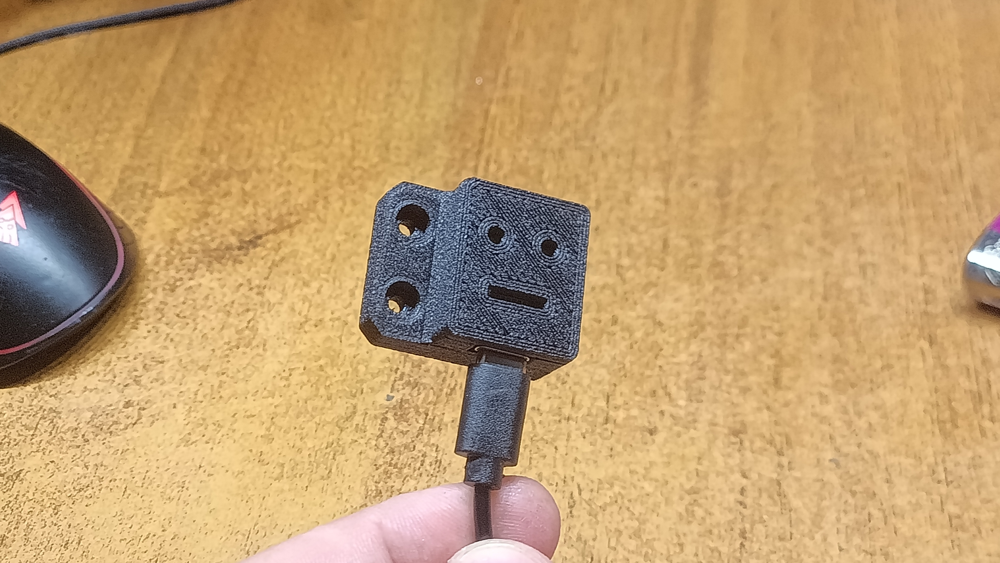
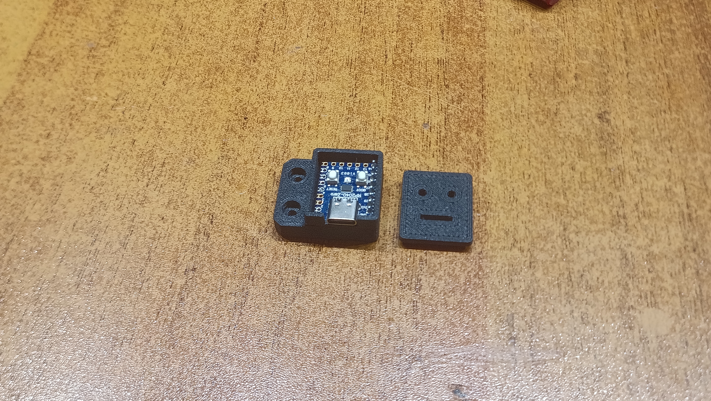
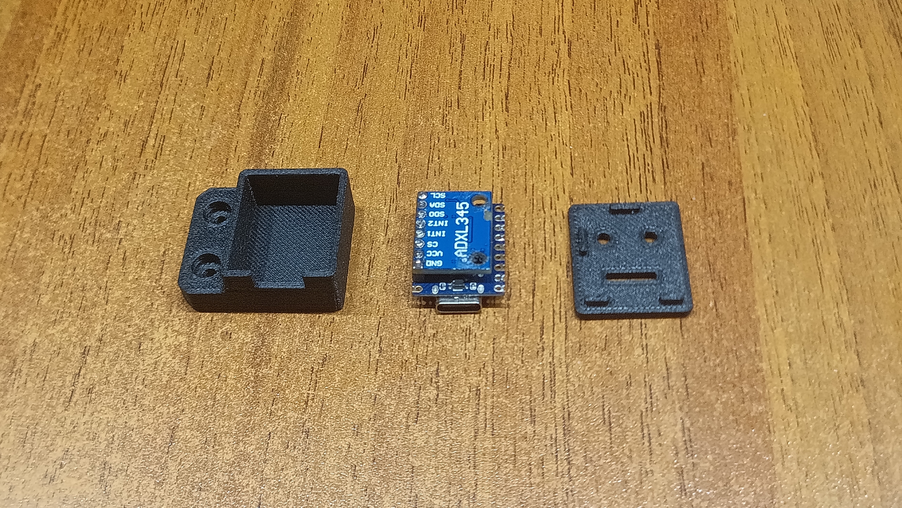

# USB-акселерометр RP2040-Zero + ADXL345 для Klipper

Автор: [id-ex](https://github.com/id-ex) · [Лицензия MIT](LICENSE)

[English](README.md) · [Пример конфигурации](config/adxl.cfg)

## Внешний вид

| Рендер корпуса | Рендер корпуса |
|---|---|
|  |  |

### Фотографии сборки



<details>
<summary>Ещё фотографии</summary>





</details>

## Зачем этот проект
Готовые USB-акселерометры для настройки принтера могут стоить заметно дороже двух доступных модулей — RP2040-Zero и ADXL345 (GY-291). Здесь они объединены в компактный USB-датчик с печатным корпусом. Контакты удобно соединяются гребёнкой и короткими перемычками: сборка простая, деталей минимум. Итоговая экономия зависит от местных цен.

Акселерометр измеряет вибрации механики. По измерениям Klipper подбирает Input Shaping — фильтры, уменьшающие рябь и «эхо» на стенках моделей. Это помогает выбирать ускорения с приемлемым качеством печати. Сам датчик вибрации не гасит и механические неисправности не исправляет. После калибровки его можно снять: фильтры работают без датчика.

В репозитории находятся STEP-модели корпуса и крышки, рендеры, фотографии сборки и пример `config/adxl.cfg`.

## Распиновка именно этой сборки
Распиновка соответствует конфигурации собранного устройства. Это не схема GP0–GP3 из некоторых инструкций для Pico. Ориентируйтесь на маркировку GPIO, а не на положение платы на фотографии.

| Контакт ADXL345 | RP2040-Zero | Назначение |
|---|---|---|
| VCC | 3V3 | Питание модуля |
| GND | GND | Общий провод |
| CS | GP29 | Выбор датчика |
| SCL / SCLK | GP14 | Тактирование SPI |
| SDA / MOSI | GP15 | Данные от контроллера |
| SDO / MISO | GP26 | Данные от датчика |
| INT1 | GP28 | Соединён в сборке, Klipper не использует |
| INT2 | GP27 | Соединён в сборке, Klipper не использует |

Используется программный SPI. INT1/INT2 для работы ADXL345 в Klipper подключать необязательно; соответствующие GPIO не нужно назначать выходами. Логика — 3,3 В, GPIO RP2040 не допускают 5 В. Для другого варианта модуля проверьте схему его питания. Короткие SPI-соединения уменьшают восприимчивость к помехам, но не исключают их полностью. USB-кабель должен поддерживать передачу данных.

## Прошивка
RP2040 работает дополнительным MCU, а USB подключается к хосту Klipper, не к плате управления двигателями.

Собирайте прошивку из исходников версии Klipper, установленной на хосте. Для RP2040-Zero выберите архитектуру Raspberry Pi RP2040, модель RP2040 (если есть отдельный пункт) и интерфейс USB:

```bash
cd ~/klipper
make menuconfig
make clean
make
```

Не перезаписывайте без резервной копии настройки сборки основной платы принтера. Удерживая BOOT, подключите Zero к ПК; скопируйте `out/klipper.uf2` на накопитель `RPI-RP2`. После копирования плата перезагрузится.

## Конфигурация
Переносимый пример находится в `config/adxl.cfg`. Скопируйте его рядом с `printer.cfg` и укажите серийный порт своей платы.

```ini
[mcu adxl]
serial: /dev/serial/by-id/usb-Klipper_rp2040_REPLACE_WITH_YOUR_ID-if00

[adxl345]
cs_pin: adxl:gpio29
spi_software_sclk_pin: adxl:gpio14
spi_software_mosi_pin: adxl:gpio15
spi_software_miso_pin: adxl:gpio26

[resonance_tester]
accel_chip: adxl345
probe_points:
    117.5, 117.5, 20
```

Замените шаблон serial фактическим путём из `ls /dev/serial/by-id/`. Алиас `/dev/adxl` работает только при отдельной настройке на хосте. Точка тестирования приведена для данного принтера; на другом проверьте доступность координат и зазоры. При изменении ориентации датчика при необходимости задайте `axes_map` в секции `[adxl345]`.

## Включение и калибровка
По умолчанию держите подключение датчика выключенным: `#[include adxl.cfg]`.

1. Не во время печати: жёстко закрепите датчик на измеряемом узле. Мягкий скотч и люфт корпуса искажают измерения. Кабель не должен мешать перемещениям.
2. Подключите USB к хосту Klipper. Файл `adxl.cfg` должен лежать рядом с `printer.cfg`.
3. В `printer.cfg` включите строку и выполните Save & Restart:
   ```ini
   [include adxl.cfg]
   ```
4. В консоли Mainsail проверьте датчик:
   ```text
   ACCELEROMETER_QUERY
   MEASURE_AXES_NOISE
   ```
5. Для Ender-3 измеряйте оси раздельно: X — датчик на печатающей голове, Y — на подвижном столе. Перед движениями убедитесь в свободном ходе и выполните парковку:
   ```text
   G28
   SHAPER_CALIBRATE AXIS=X
   SAVE_CONFIG
   ```
   Затем переставьте датчик на стол, проверьте его отклик и повторите:
   ```text
   G28
   SHAPER_CALIBRATE AXIS=Y
   SAVE_CONFIG
   ```
   Если перестановка требует отключения USB, сначала отключите include и перезапустите Klipper; после подключения включите его снова.

`SAVE_CONFIG` сохраняет фильтры и перезапускает Klipper. Рекомендуемое тестом ускорение не применяется автоматически — оцените его отдельно. Не копируйте частоты с другого принтера: используйте результаты собственных измерений.

## Отключение после калибровки
1. Оставьте сохранённые параметры `[input_shaper]` в `printer.cfg` / блоке SAVE_CONFIG — они нужны при печати.
2. Закомментируйте только подключение датчика:
   ```ini
   #[include adxl.cfg]
   ```
3. Выполните Save & Restart, затем отключите USB и снимите датчик.

Не переносите `[input_shaper]` в отключаемый `adxl.cfg`. Если отключить USB при активном include, Klipper потеряет дополнительный MCU и остановится. Для следующей калибровки подключите модуль и снова включите include. Повторять измерения полезно после изменений механики, натяжения ремней или массы головы/стола.

## Публикация и лицензия
Оригинальные файлы проекта (конфигурация, документация, CAD корпуса и изображения) распространяются под [лицензией MIT](LICENSE). Она не распространяется на сторонние модели компонентов. Из 3D-файлов публикуются только корпус и крышка в STEP. Сторонние модели и сборка FreeCAD исключены из Git. Локальная копия `adxl.cfg` также исключена; для публикации используется `config/adxl.cfg`. См. [PUBLISHING.md](PUBLISHING.md).
